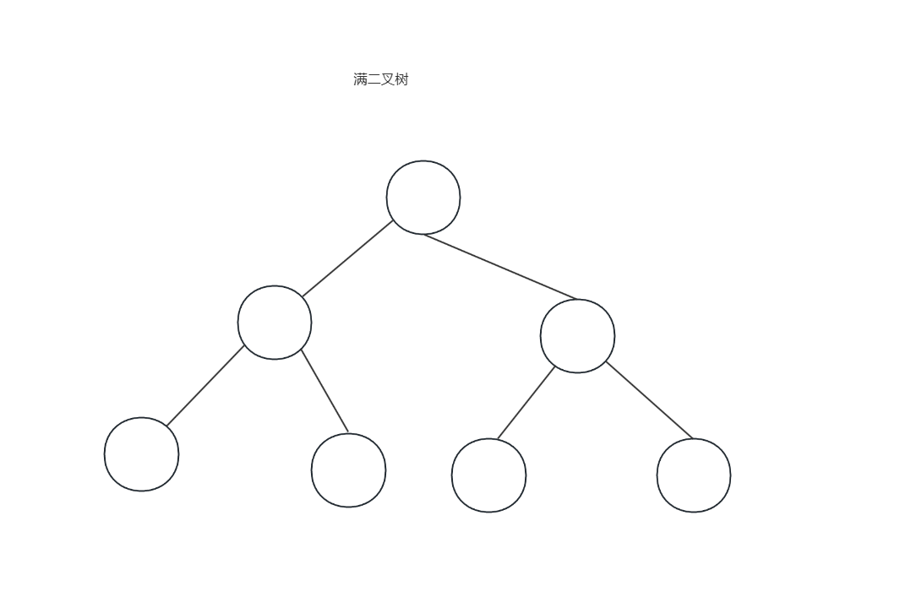
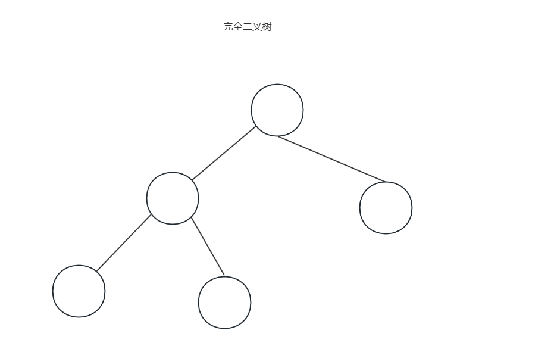
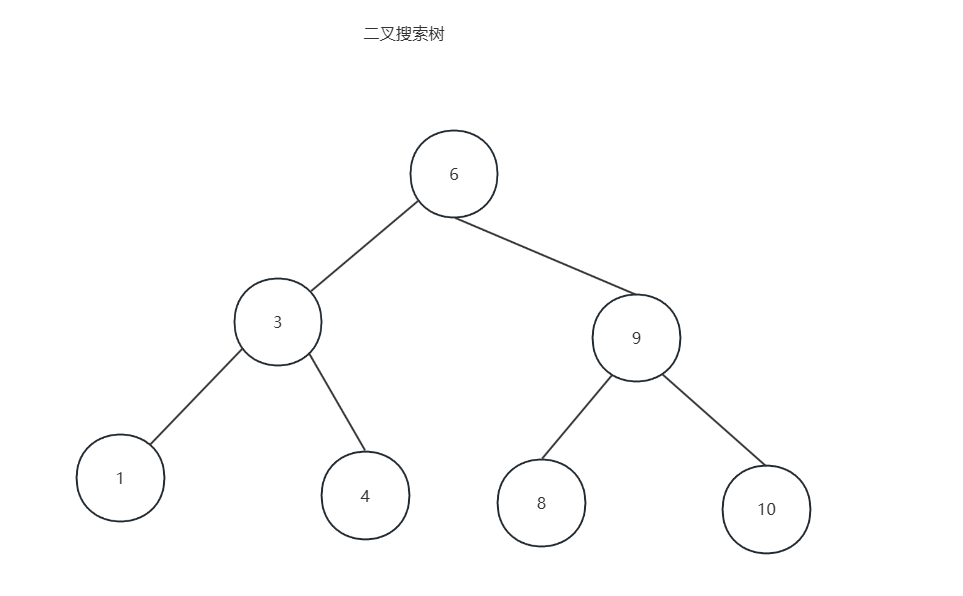

# 定义

二叉树（Binary Tree）是**每个节点最多有两个子节点**的树形数据结构，这两个子节点分别称为**左子节点**和**右子节点**。左右子树是有顺序的，不能随意交换。

标准二叉树节点结构：

```java
class TreeNode {
    int val;
    TreeNode left;
    TreeNode right;

    TreeNode() {}

    TreeNode(int val) {
        this.val = val;
    }

    TreeNode(int val, TreeNode left, TreeNode right) {
        this.val = val;
        this.left = left;
        this.right = right;
    }
}
```


# 种类

## 满二叉树

特点：

1. 所有层**完全填满**
2. 所有叶子节点在**同一层**
3. 除叶子外，每个节点都有两个子节点
4. 若高度为 h （根为第1层），则总节点数为： n=2^h-1



## 完全二叉树

特点

1. 除**最后一层**外，其他层全部填满；

2. 最后一层的节点**从左到右连续排列**，**不能有空洞**；

3. **满二叉树是完全二叉树的特例**；

4. 常用于**堆（Heap）** 的实现；

5. 在数组中存储时，若根节点编号为1，则：

	- 节点i的左孩子在2i，右孩子在2i+1
	- 父节点在i/2
	- 完全二叉树中，**度为1的节点最多只有1个**，且只能是**只有左孩子**

	

## 二叉搜索树

特点：

1. 是一种**有序二叉树**；
2. 满足：
	- 左子树所有节点值 **< 根节点值**；
	- 右子树所有节点值 **> 根节点值**；
	- 左右子树也分别是BST；
3. 中序遍历结果为**升序序列**；
4. 查找、插入、删除平均时间复杂度为 O(log⁡n)*O*(log*n*) ，但最坏退化为链表（ O(n)*O*(*n*) ）。



## 平衡二叉搜索树

一种在**保持二叉搜索树（BST）有序性**的同时，通过特定机制**限制树的高度**，从而确保查找、插入、删除等操作的时间复杂度始终维持在 **O(log⁡n)\*O\*(log\*n\*)** 的高效数据结构。

### 类型

AVL树：平衡二叉查找树

- 特点：      
	- 左右子树高度差的绝对值不超过
	- 四种旋转

红黑树

最长路径≤2×最短路径

- 特点：
	- 节点是红色或黑色
	- 根节点是黑色
	- 所有叶子(NIL空节点)是黑色
	- **红色节点的子节点必须是黑色**（即不能有两个连续的红节点）
	- 从任一节点到其所有后代叶子的路径上，**黑色节点数量相同**（黑高一致）

## 存储方式

### 链式存储

原理：每个节点是一个结构体(或对象),包含：数据域、左孩子指针、右孩子指针、(可选)父节点指针

### 顺序存储

原理：使用数组按层序遍历的顺序存储节点，根节点放在索引1，

节点在位置i：左孩子就是2i、右孩子就是2i+1、父节点就是i/2

**局限性** ：仅适用完全二叉树或满二叉树

*通常一般适用链式存储*

## 遍历方式

1. 前序：**顺序**：根 → 左子树 → 右子树
2. 中序：**顺序**：左子树 → 根 → 右子树
3. 后序：**顺序**：左子树 → 右子树 → 根
4. 层序：**顺序**：从上到下、从左到右逐层访问

| 遍历方式         | 搜索类型 | 数据结构            | 访问特点         |
| ---------------- | -------- | ------------------- | ---------------- |
| 前序、中序、后序 | DFS      | 递归栈 / 显式 Stack | 深入到底，再回溯 |
| 层序遍历         | BFS      | Queue               | 一层一层横向扩展 |

